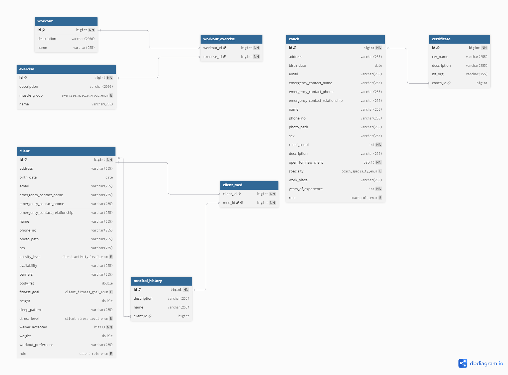

# Database Design

## Overview
- GrindHub uses  **MySQL** as its relational database management system. 
The database is designed to store information about clients, coaches, workouts, exercises, certifications, and medical 
histories while maintaining data integrity through foreign key constraints. It follows a normalized relational design.

- Java entities are mapped to database tables using **Spring Data JPA** and **Hibernate**
- Primary keys are used to identify each record
- Foreign keys enforce relationship between tables.
- Junction tables implement many-to-many relationship.
- Hibernate automatically maps Java entities into MySQL tables.


---

# Entity relationship Diagram

---

# Tables

## I. Client

### 1. Description

Stores personal information, health information, and fitness preference for each client

| Column | Java type | MySQL Type                         | Description                                                                      |
|--------|-----------|------------------------------------|----------------------------------------------------------------------------------|
| id | Long | BIGINT                             | Primary key                                                                      |
| address| String | VARCHAR(255)                       | Billing address                                                                  |
|birth_date| LocalDate| date                               | User's birthdate                                                                 |
| email | String | VARCHAR(255)                       | User's email                                                                     | 
| emergency_contact_name | String | VARCHAR(255)                       | Emergency contact name                                                           |
| emergency_contact_phone | String | VARCHAR(255)                       | Emergency contact phone number                                                   |
| emergency_contact_relationship | String | VARCHAR(255)                       | Emergency contact relationship to member                                         |
| name |  String | VARCHAR(255)                       | User's name                                                                      |
| phone_no|  String | VARCHAR(255)                       | User's phone                                                                     |
| photo_path |  String | VARCHAR(255)                       | User's avatar                                                                    |
| Sex |  String | VARCHAR(255)                       | User's sex at birth                                                              |
| availability |  String | VARCHAR(255)                       | If online coaching is needed, when will the client be free to meet with coach?   |
| activity_level | Level (ENUM) | ENUM                               | How intense the client exercise                                                  | 
| barriers | Barrier (ENUM) | VARCHAR(255)                       | What barriers a client may have that limit their grinding journey                | 
| bodyFat | Double | DOUBLE                             | (Optional) Client's body fat                                                     | 
| fitness_goal | Goal (ENUM) | ENUM                               | Client's fitness goal (Injury recovery, muscle gain,...)                         |
| weight | Double | DOUBLE                             | Client's weight                                                                  |
| height | Double | DOUBLE                             | Client's height                                                                  | 
| sleep_pattern | Pattern (ENUM) | VARCHAR(255)                       | Client's sleep_pattern, which cah help a coach in designing workout              |
| stress_level | Level (ENUM) | ENUM                               | Client's stress level, helps with designing workout and coach-client interaction |
| waiver_accepted | boolean | BIT(1)                             | Indicates whether the waiver was accepted                                        | 
| workout_preference | WorkoutPreference (ENUM) | VARCHAR(255) | How the client wants to workout                                                  |
| role | Role (ENUM) | ENUM | For the system to generate appropriate content                                   | 
### 2. Relationships
 - One client can have many Medical History records
 - One client can participate in many Workout Plans.

---

## II. Coach

### 1. Description
Stores coach information, experience, and availability

| Column | Java type | MySQL Type                            | Description                                                                      |
|--------|-----------|---------------------------------------|----------------------------------------------------------------------------------|
| id | Long | BIGINT                                | Primary key                                                                      |
| address| String | VARCHAR(255)                          | Billing address                                                                  |
|birth_date| LocalDate| date                                  | User's birthdate                                                                 |
| email | String | VARCHAR(255)                          | User's email                                                                     |
| emergency_contact_name | String | VARCHAR(255)                          | Emergency contact name                                                           |
| emergency_contact_phone | String | VARCHAR(255)                          | Emergency contact phone number                                                   |
| emergency_contact_relationship | String | VARCHAR(255)                          | Emergency contact relationship to member                                         |
| name |  String | VARCHAR(255)                          | User's name                                                                      |
| phone_no|  String | VARCHAR(255)                          | User's phone                                                                     |
| photo_path |  String | VARCHAR(255)                          | User's avatar                                                                    |
| Sex |  String | VARCHAR (255)                         | User's sex at birth                                                              |
| client_count | int | int | Coach's current client count |
| description | String | VARCHAR(255) | Coach's hook to attract client |
| open_for_new_client | boolean | BIT(1) | Is the coach open for new client? |
| specialty | Specialty (ENUM) | ENUM | What workout style is the coach good at? |
| workplace | String | VARCHAR(255) | Where the coach is working at |
| years_of_experience | int | int | Coach's years of experience |
| role | Role (ENUM) | ENUM | For the system to generate appropriate content | 

### 2. Relationships
- One Coach has many Certificates
- One Coach can manage multiple Workout Plans. 

---

## III. Certificate

### 1. Description

Stores professional certifications earned by coaches

| Column | Java type | MySQL Type    | Description                                                                      |
|--------|-----------|---------------|----------------------------------------------------------------------------------|
| id | Long | BIGINT        | Primary Key | 
| cer_name | String | VARCHAR (255) | Certificate name |
| description | String | VARCHAR (255) | What the certificate is about |
| iss_org | String | VARCHAR (255) | Issuing organization |
| Coach_id | Long | BIGINT | Foreign Key |

### 2. Relationships

- Each Certificate belongs to one Coach
- One Coach may own multiple Certificates.

## IV. Exercise

### Description
Stores exercises that can be used in workout plans.

| Column | Java Type          | MySQL Type | Description |
|----------|--------------------|------------|-------------|
| id | Long               | BIGINT | Primary Key |
| name | String             | VARCHAR(255) | Exercise name |
| description | String             | VARCHAR(2000) | Exercise instructions | 
| muscle_group | MuscleGroup (ENUM) | VARCHAR (255) | Target muscle group |

---

## V. Workout

### Description
Stores workout templates that group multiple exercises into a structured training session.
A workout represents the overall routine (e.g., Leg Day, Push Day, Full Body, HIIT,...) while the individual exercises are stored separately in the `Exercise` table. 
The relationship between workouts and exercises is implemented through the `workout_exercise` junction table, allowing a workout to contain multiple exercises, and an exercise can be reused through multiple workouts.

| Column | Java Type | MySQL Type | Description |
|----------|-----------|------------|-------------|
| id | Long | BIGINT | Primary key |
| name | String | VARCHAR(255) | Workout name |
| description | String | VARCHAR(2000) | Workout description |

### Example Records
| Name | Description |
|------|-------------|
| Leg Day | Lower body strength workout focusing on the quadriceps, hamstrings, glutes, and calves. |
| Push Day | Upper body workout targeting the chest, shoulders, and triceps. |
| Pull Day | Back and biceps workout. |
| Full Body | Workout targeting all major muscle groups in a single session. |
| HIIT | High-intensity interval training designed to improve cardiovascular fitness. |
| Home Workout | Equipment-free workout suitable for training at home. |

---

## VI. Medical history

### 1. Description
Stores medical conditions reported by a client that may affect workout planning, exercise selection, or coaching recommendations.

| Column | Java Type | MySQL Type | Description |
|----------|-----------|------------|-------------|
| id | Long | BIGINT | Primary key | 
| name | String | VARCHAR(255) | Name of the medical condition |
| description | String | VARCHAR(255) | Additional details provided by the client |
| client_id | Long | BIGINT | Foreign key referencing the associated client |

### 2. Relationships
- Each medical history record belongs to only one Client
- One Client can have multiple Medical History Record.

### 3. Example Records

| Name | Description |
|------|-------------|
| Diabetes | Type 2 diabetes diagnosed in 2021. |
| Knee Injury | Torn ACL during soccer in 2023. |
| High Blood Pressure | Controlled with medication. |
| Shoulder Pain | Pain occurs during overhead pressing exercises. |

### 4. Design decision
- Medical history conditions are stored as free-text values rather than being linked to a predefined medical condition look up table.
- This design was selected to reduce implementation complexity and support faster development of the initial application version. It allows client to report injuries, illnesses, surgeries, allergies, and other health concerns without requiring the application to maintain a complete list of medical conditions.
- One of the tradeoff is that clients may enter a medical condition in different forms (High blood pressure -> HBP, ...). If standardized reporting, filtering, or automated recommendations become necessary, this design may later be replaced with a medical-condition lookup table.  

# Junction Tables

## I. workout_exercise
Connects workouts and their associate exercises.


| Column | MySQL Type |
|----------|------------|
| workout_id | BIGINT |
| exercise_id | BIGINT |

---
## II. client_med

Connects clients with their associate medical histories. Here, client_id and med_id form a composite primary key.

| Column | MySQL Type |
|----------|------------|
| client_id | BIGINT |
| med_id | BIGINT |

# Relationship

| Parent | Child | Relationship |
|----------|---------|--------------|
| Coach | Certificate | One-to-Many |
| Client | MedicalHistory | One-to-Many |
| Workout | Exercise | Many-to-Many |

---

# Enum storage

Several Java fields use enums. However, in the database, Hibernate stores them as 'VARCHAR' columns using

```java
@Enumerated(EnumType.STRING)
```

This approach makes the database easier to read and avoids problem when storing enum ordinal values. For example, since the Enum field is stored as VARCHAR in
the database, we don't have to update the schema every time we have a new Enum value.

Examples include:

- Goal
- WorkoutPreference
- ActivityLevel
- Specialty
- Role